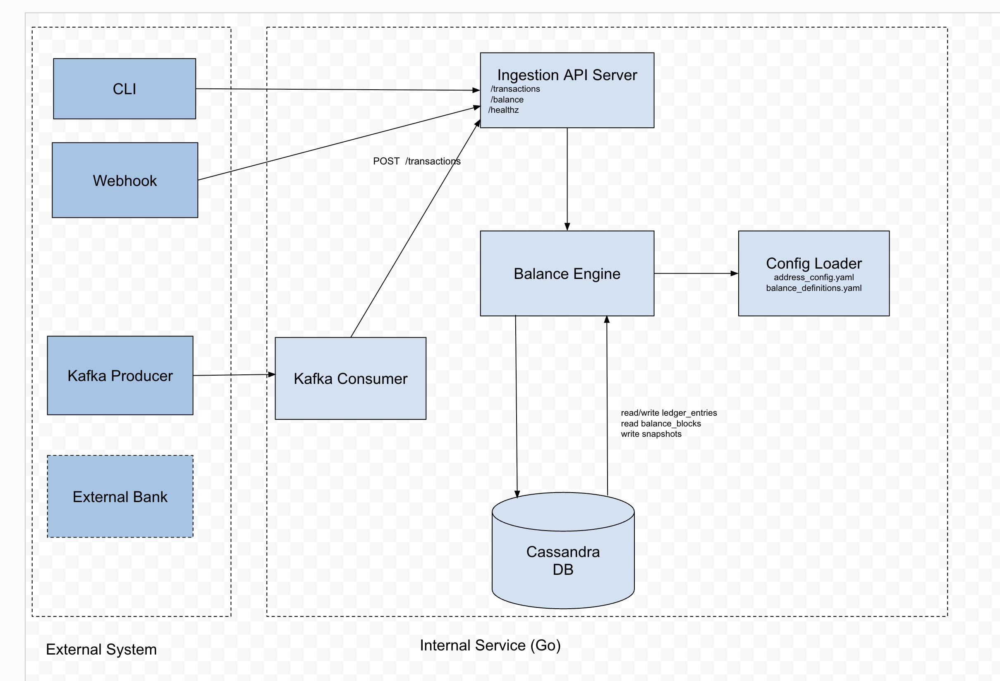

## Overview

`go-cassandra-ledger` is a Monzo-inspired, event-driven financial ledger system built in Go (Golang) and backed by Cassandra. It implements a production-grade, double-entry, append-only ledger with time-bucketed storage, balance definition abstraction, and scalable read/write pattern for modern FinTech systems.

This project closely models the real architecture published by Monzo in their [Engineering Blog](https://monzo.com/blog/2023/04/28/speeding-up-our-balance-read-time-the-planning-phase), and serves as an open-source educational tool, with all production constraints, patterns, and solutions considered part of the MVP.

## Design Goals

- Accurately model a double-entry ledger with clear transactional integrity.
- Support high-write throughput via append-only Cassandra design.
- Support multiple balance types (e.g customer-facing, interest-chargeable)
- Enable fast balance computation using precomputed blocks and parallel reads.
- Enable time-based filtering and snapshot queries.
- Embrace real-world production patterns from Monzo's Architecture.
- Maintain auditability via immutable entries and time axis design.

## Key Concepts & Terminology

- **Ledger**: Source of truth for all money movement, modeled as append-only double-entry bookkeeping.
- **EntrySet**: Group of one or more ledger entries representing a single money movement.
- **Ledger Address**: A unique identifier for where money resides or flows (5-tuple: `legal_entity`, `namespace`, `name`, `currency`, `account_id`).
- **Balance Name**: Label representing a logical balance type (e.g. `customer-facing-balance`, `interest-chargeable-balance`).
- **Commited Timestamp**: Time when an entry is persisted in the ledger; used for partitioning.
- **Reporting Timestamp**: Time when the entry takes accounting effect; used for financial reports.
- **Balance Block**: Precomputed partial balance sums per address and time bucket for efficient reads.
- **Time Axis**: Defines how time should be interpreted for balance reads; committed or reporting.

## Architecture Overview And System Components

- **Ingestion API**: Accepts transactions (EntrySets), persists them to Cassandra.
- **Kafka Consumer(optional)**: Accepts events from a stream to populate the ledger.
- **Balance Engine**: Computes balances using full scan or precomputed blocks.
- **Config Loader**: Loads `address.yml` and `balance_definitions.yml` to abstract logic.
- **Snapshot Generator**: Periodically saves balance snapshots (for `as_of` queries).
- **Ledger Query API**: Exposes `/transactions`, `/balances`, `/snapshots`, etc.
- **Healthcheck**: Exposes `/health` for liveness probes.

## Data Models

1. **Ledger Entries Table (`ledger_entries`)**

| Field        | Type                                       |
| ------------ | ------------------------------------------ |
| account_id   | TEXT                                       |
| time_bucket  | TEXT (e.g. 2025-06)                        |
| committed_ts | TIMESTAMP                                  |
| reporting_ts | TIMESTAMP                                  |
| txn_id       | UUID                                       |
| type         | TEXT (credit or debit)                     |
| amount       | DECIMAL                                    |
| address      | TEXT (flattened string of 5-tuple)         |
| description  | TEXT                                       |
| flake_id     | TEXT (sortable ID with embedded timestamp) |

```sql
PRIMARY KEY ((account_id, time_bucket), committed_ts)
```

2. **Balance Blocks Table (`balance_blocks`)**

| Field        | Type      |
| ------------ | --------- |
| account_id   | TEXT      |
| time_bucket  | TEXT      |
| balance_name | TEXT      |
| partial_sum  | DECIMAL   |
| last_txn_ts  | TIMESTAMP |

Purpose:

- Speed up balance reads by skipping full historical scans.
- Blocks can be merged during snapshot creation.

3. **Balance Snapshots Table (`balance_snapshots`)**

| Field            | Type      |
| ---------------- | --------- |
| account_id       | TEXT      |
| balance_name     | TEXT      |
| snapshot_date    | DATE      |
| snapshot_balance | DECIMAL   |
| computed_at      | TIMESTAMP |

Purpose:

- Supports queries like: "What was my balance on Jan 1, 2024?"

4. Config Files (Versioned)
   `address_config.yml`

```yaml
addresses:
  - name: main
    namespace: com.ledger
    currency: GBP
    legal_entity: ledger_uk
    account_id: dynamic
```

`balance_definitions.yml`

```yaml
balances:
  - name: customer-facing-balance
    time_axis: committed
    address_names:
      - main
  - name: interest-chargeable-balance
    time_axis: reporting
    address_names:
      - main
```

## API Endpoints

| Method | Endpoint                               | Description                                      |
| ------ | -------------------------------------- | ------------------------------------------------ |
| POST   | /transactions                          | Ingest EntrySet (credit/debit pair)              |
| GET    | /ledger/{account_id}                   | Fetch all ledger entries                         |
| GET    | /balance/{account_id}                  | Compute live balance using blocks                |
| GET    | /balance/{account_id}?as_of=2025-01-01 | Historical balance using snapshot + recent delta |
| GET    | /snapshot/{account_id}                 | Get last known balance snapshot                  |
| GET    | /healthz                               | Healthcheck                                      |

## Balance Computation Logic

### Option 1: Full Scan (fallback)

- Fetch all entries in the address set for a balance.
- Sum amounts (respecting time axis + balance type).

### Option 2: Block-Based

- Fetch `balance_blocks` sum for older buckets.
- Fetch recent entries from current bucket.
- Sum both for near-instant balance.

### Option 3: Historical Snapshot + Delta

- Use last snapshot (`as_of`)
- Apply delta from entries > snapshot date.
- Return `snapshot_balance + delta`.

## Partitioning & Bucketing

| Strategy      | Detail                                                               |
| ------------- | -------------------------------------------------------------------- |
| Partition key | account_id + time_bucket                                             |
| Clustering    | committed_ts DESC                                                    |
| Bucket size   | Default: 1 month (adjustable)                                        |
| Benefit       | Prevents unbounded partition growth, improves read/query performance |

## Handling External Money Movement: Inbound Transfers

In real-world banking systems, not all transactions originate within the institution's ledger. For example, a Monzo customer may receive money from an external bank or card network. Even in these cases, double-entry integrity must be preserved.

To support this, we introduce the concept of synthetic internal ledger addresses to represent external systems.

### Example: External Transfer into Customer Account

When Bob (a Monzo user) receives £100 from an external bank, the ledger records:

| Type   | Account ID            | Amount | Description                    |
| ------ | --------------------- | ------ | ------------------------------ |
| Debit  | external_inbound_bank | £100   | Inbound transfer from external |
| Credit | bob456                | £100   | Received from Alice            |

This EntrySet models a complete money movement:

```json
{
  "entry_set_id": "uuid-7890",
  "entries": [
    {
      "account_id": "external_inbound_bank",
      "type": "debit",
      "amount": 100.0,
      "description": "Inbound transfer from external bank"
    },
    {
      "account_id": "bob456",
      "type": "credit",
      "amount": 100.0,
      "description": "Received from Alice"
    }
  ]
}
```

### Synthetic Ledger Address: External Inbound Bank

To support this logic, the system includes predefined internal ledger addresses for external systems:

```yaml
- account_id: external_inbound_bank
  namespace: com.ledger.inbound
  name: settlement
  legal_entity: ledger_uk
  currency: GBP
```

This ensures:

- All money movement remains traceable within the ledger.
- EntrySets are always balanced (sum to zero).
- External payments rails (e.g FPS, Mastercard, BACS) can be reconciled against this account.

### Benefits

- Auditability: Every penny is accounted for, even across system boundaries.
- Consistency: Double-entry integrity is maintained system-wide.
- Extendability: Enables modeling of external-to-internal and internal-to-external transactions symmetrically.

## Testing & Simulation

### Phase 1: Bash Script

- Simulate realistic traffic by firing 1000+ transactions per user.
- Vary between credit and debit, random timestamps.
- Validate ingestion and read paths.

### Phase 2: Kafka Ingestion Simulator (Post-MVP)

- Build event-based simulator in Go.
- Publishes EntrySet events (salary, ATM withdrawal, refunds, etc.)
- `go-cassandra-ledger` listens via Kafka consumer and ingests live.

## How the components work together

A Kafka consumer can:

- Listen to incoming events (from a topic).
- Decode/process the message
- Transform and validate
- Directly insert into the database or
- Call interrnal functions (like a balance engine) to do the work.



## Future Improvements

| Feature               | Benefit                                    |
| --------------------- | ------------------------------------------ |
| Adaptive bucketing    | High-activity users get smaller buckets    |
| Balance change stream | Real-time push-based balance update events |
| Smart fraud rules     | Anomaly scoring at ingestion               |
| Parallel bucket reads | For power users with large history         |
| Custom balance views  | Configurable by external teams or users    |
